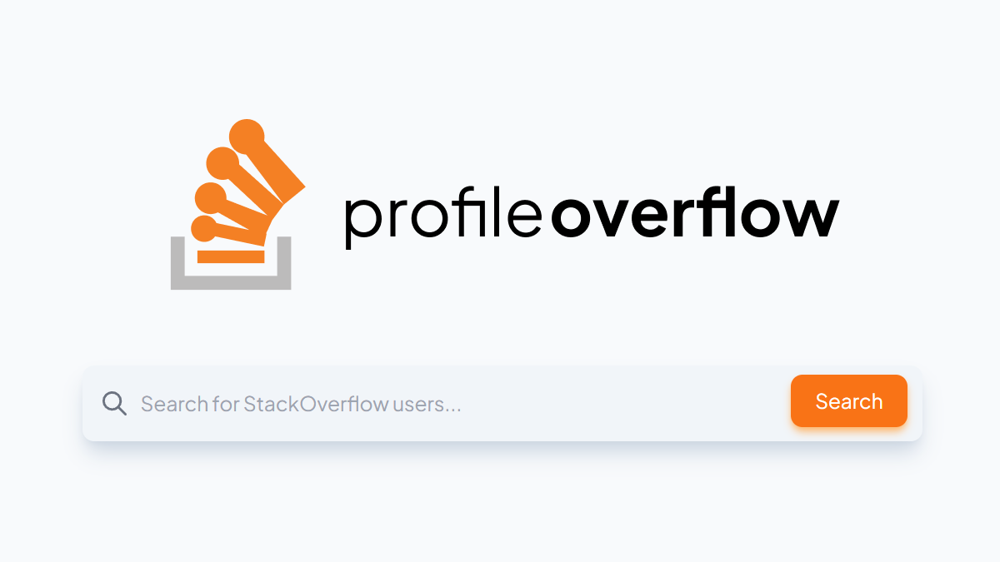

# ProfileOverflow

A simple app leveraging [StackExchange APIs](https://api.stackexchange.com/) to show some StackOverflow accounts information. Made for fun during a weekend as practice.

This project is not affiliated with [StackOverflow](https://stackoverflow.com/) in any way.

## Getting up and running

```
pnpm install
pnpm run dev
```

If you are forking this, you should [register for your own StackApp](https://stackapps.com/apps/oauth/register) and update the values in [`./src/lib/stackapps/index.ts`](./src/lib/stackapps/index.ts) accordingly.

## Notes about OG image generation

The OG image generation requires chromium to be installed. On WSL2, use the following command to install it.

```
# install packages
sudo apt-get install -y curl unzip xvfb libxi6 libgconf-2-4 fonts-liberation
# get latest chrome
wget https://dl.google.com/linux/direct/google-chrome-stable_current_amd64.deb

# install it
sudo apt install ./google-chrome-stable_current_amd64.deb

```

There is a bug that cause the OG image generation to not work properly in Node 16. Update the Vercel project to Node 14 to work around this for now. ([See related StackOverflow thread](https://stackoverflow.com/questions/66214552/tmp-chromium-error-while-loading-shared-libraries-libnss3-so-cannot-open-sha/72626919#72626919))
